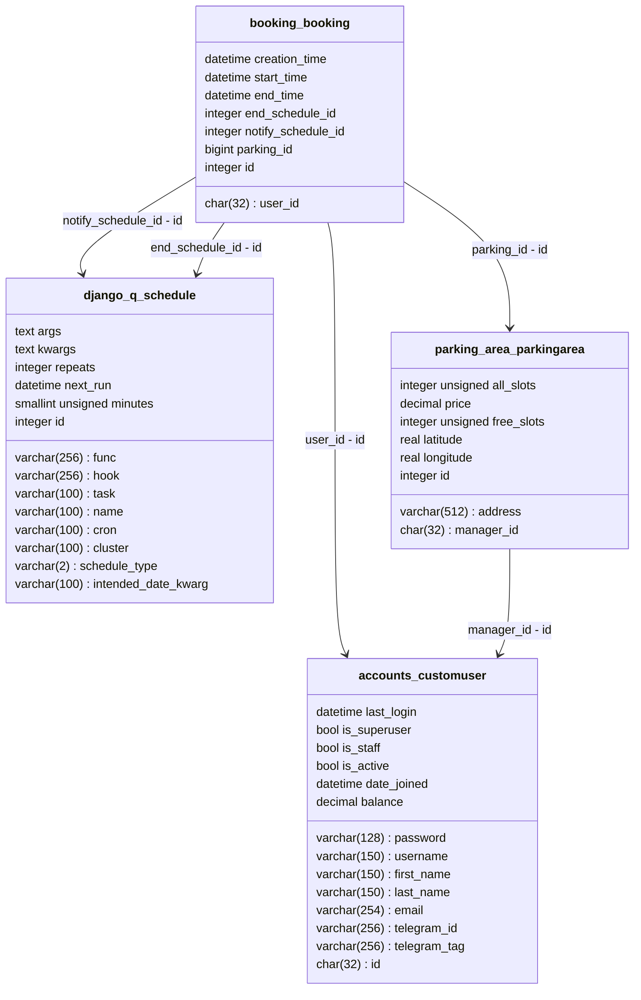

# Parking System with booking

Прежде всего, для запуска проекта требуется создать файл `.env` и заполнить по шаблону `.env.example`.

```
BOT_TOKEN= #Токен бота для уведомлений
BOT_TAG= #Тег бота для уведомлений без @
DJANGO_PORT= #Порт для развертки сервиса
```

Поставьте `docker` и `docker compose` по инструкции из официальной документации.

Затем запустите контейнеры

```shell
docker compose up
```

### В проекте есть несколько приложений

- `accounts`
- `booking`
- `parking_area`
- `core (изначальное приложение с файлом настроек)`

Каждый из них (за исключением связующего ядра) включает в себя модели и классовые View обработчики, которые доступны по
определенным путям (Routes, Urls).

Список путей (за исключением неиспользуемых/библиотечных):

```
- /
- admin/
    - ...
- booking/
    - add/<int:pk>
    - management/
    - history/
    - <int:pk>/start/
    - <int:pk>/end/
    - <int:pk>/delete/
    - <int:pk>/prolong/
- parking/
    - add/
    - management/
    - <int:pk>/detail/
    - <int:pk>/delete/
    - <int:pk>/update/
- accounts/
    - signup/
    - update/
```

Стоит уточнить, что у каждого из путей разрешены разные типы запросов, а также используются различные параметры
закодированные в адресной строке.

Можно заметить, что везде, кроме `booking/add/<int:pk>` указывается ключ объекта, принадлежащего пути, но конкретно в
данном случае -- используется ключ объекта парковки, для создания новой записи бронирования и связи с ней

Для отображения объектов парковок использовано js-yandexAPI v2.1. Для обработки геокодирования используется их же "
саджест".

Система уведомлений сформирована на основе DjangoQ2.
Основной проблемой при реализации подобных задач, является синхронность фреймворка, именно поэтому создается отдельный
кластер для обработки очереди отложенных задач, который работает в фоне.
Чаще всего для решения данной проблемы, да и в целом для задач связанных с выполнением по расписанию,
используется `Celery` но в данном случае -- это как топором хлеб резать ("overkill").

Снизу представлена диаграмма связей основных используемых моделей БД

